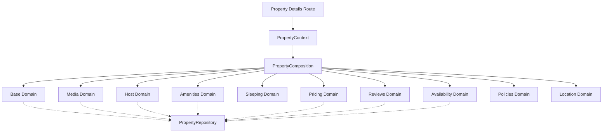

# Property Domain Architecture

This document defines the architectural boundaries, ownership, and caching strategy for the Property Details aggregate.

## The Property Aggregate

The Property Details page is not a single database query. It is an aggregation of independent domains, composed at the edge/server layer to maximize performance and fault isolation.



---

## Domain Boundaries & Caching Strategy

Every sub-domain is responsible for its own data fetching, Redis caching, and error handling. We explicitly avoid caching the "fully assembled" page to prevent high-velocity domains (like Pricing/Availability) from thrashing the cache for static domains (like Media/Amenities).

| Domain           | Responsibility                                             | Cache Key Structure          | Cache TTL | Invalidation Strategy      |
| ---------------- | ---------------------------------------------------------- | ---------------------------- | --------- | -------------------------- |
| **Base**         | Title, description, property type, status, basic capacity. | `property:{id}:base`         | 15 mins   | Time-based (SWR)           |
| **Media**        | Images, videos, 360-tours, alt-tags, display order.        | `property:{id}:media`        | 15 mins   | Time-based (SWR)           |
| **Host**         | Host profile, verification status, response rate, tenure.  | `property:{id}:host`         | 15 mins   | Time-based (SWR)           |
| **Amenities**    | Categorized amenities, grouped by room or type.            | `property:{id}:amenities`    | 1 hour    | Time-based (SWR)           |
| **Location**     | Coordinates, address (if public), nearby transit.          | `property:{id}:location`     | 1 hour    | Time-based (SWR)           |
| **Policies**     | Cancellation rules, house rules, move-in procedures.       | `property:{id}:policies`     | 1 hour    | Time-based (SWR)           |
| **Pricing**      | Base price, dynamic modifiers, fees, taxes.                | `property:{id}:pricing`      | 5 mins    | Time-based (SWR)           |
| **Reviews**      | Aggregate rating, top reviews, category scores.            | `property:{id}:reviews`      | 5 mins    | Time-based (SWR)           |
| **Availability** | Calendar dates, blocked periods, lock status.              | `property:{id}:availability` | N/A       | **Event-Driven** (Phase 3) |

---

## Service Contracts

Each domain will expose a Service and a corresponding React Server Component (RSC) to handle streaming.

### Example: Base Domain

```typescript
interface PropertyBase {
  id: string;
  publicId: string;
  title: string;
  description: string;
  accommodationType: string;
  occupancyType: string;
  furnishing: string;
  capacity: number;
}
```

### Example: Media Domain

```typescript
interface PropertyMedia {
  coverImage: string;
  gallery: Array<{
    url: string;
    caption: string | null;
    isCover: boolean;
  }>;
}
```

---

## Implementation Principles

1. **Zero Route-Level Data Fetching:** The Next.js `page.tsx` will only extract the `id` from the URL parameter and validate its format. It will NOT fetch database records.
2. **Component-Level Orchestration:** Each section component (e.g., `<PropertyHero />`) will invoke its respective Domain Service (e.g., `MediaService.getMedia(id)`).
3. **Resilient Degradation:** If `PricingService` fails or Redis crashes, the Circuit Breaker pattern will fallback to the DB. If the DB fails, the section will render an error boundary, but the rest of the page (Hero, Amenities, Reviews) will continue to function.
