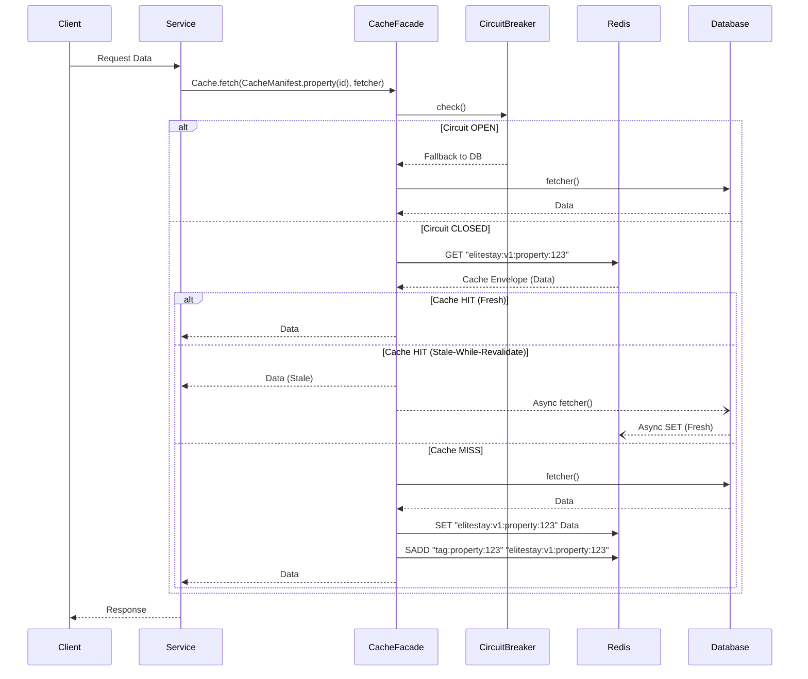
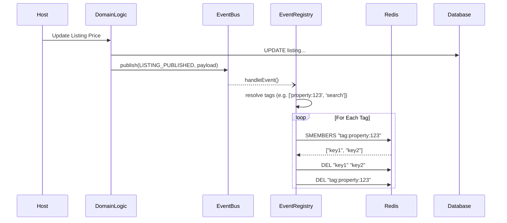
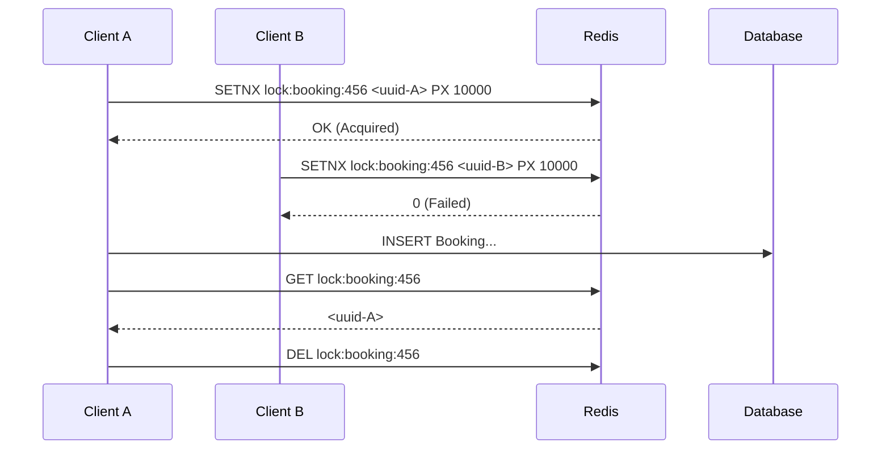
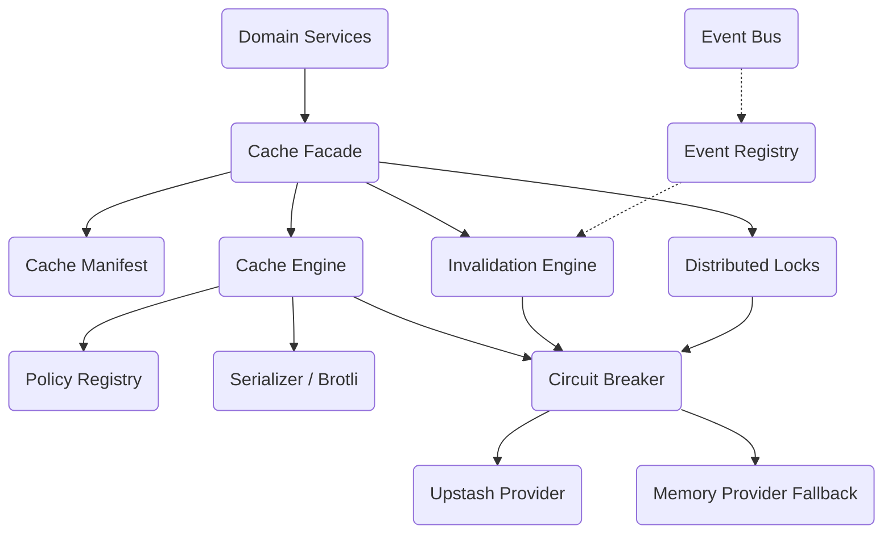

# EliteStay Redis Platform Architecture

The Redis Platform serves as the distributed state and performance layer for the EliteStay application. Following Phase 1.5 completion, the platform strictly enforces a unified cache abstraction over Upstash Serverless Redis.

## Core Architecture Principles

1. **Facade Pattern**: Consumers must only interact with `CacheFacade`. Direct interaction with `@upstash/redis` or key building logic is strictly forbidden.
2. **Data-Driven Manifest**: All cache keys, tagging strategies, and caching policies are defined declaratively in `CacheManifest`.
3. **Event-Driven Invalidation**: The platform uses a tagging mechanism (`tag:<name>`) backed by Redis Sets to group related keys. Cache invalidation is triggered asynchronously via `CacheEventRegistry` listening to the domain `eventBus`.
4. **Resiliency First**: The subsystem is protected by a Circuit Breaker pattern. If Redis becomes unresponsive, the system gracefully falls back to direct database reads without crashing the application.
5. **Observability**: Every single cache operation is instrumented via `observability/metrics.ts` to track Hits, Misses, Stale Serves, and Latencies.

---

## 1. Request Flow (Read)

---

## 2. Event-Driven Invalidation Flow

The platform relies on tags to invalidate multiple granular keys associated with a business entity. When a business event occurs, the cache registry maps the event to specific tags.

---

## 3. Distributed Lock Architecture

The platform provides a `Cache.lock()` method to acquire distributed locks, primarily used to prevent booking race conditions or stampeding herds on expensive calculations.

---

## 4. Module Dependency Structure

## Supported Operations

| Operation       | Description                                                                              | Concurrency safe? |
| --------------- | ---------------------------------------------------------------------------------------- | ----------------- |
| `fetch`         | Gets a value, falling back to database fetcher on miss. Protects against cache stampede. | ✅ Yes            |
| `get`           | Directly retrieves a value. Returns null on miss.                                        | ✅ Yes            |
| `set`           | Directly sets a value. Supports tagging and TTL policies.                                | ✅ Yes            |
| `deleteKey`     | Directly deletes a key.                                                                  | ✅ Yes            |
| `invalidateTag` | Deletes all keys associated with a tag and cleans up the set.                            | ✅ Yes            |
| `lock`          | Acquires a distributed lock.                                                             | ✅ Yes            |
| `releaseLock`   | Releases a distributed lock via ownership check.                                         | ✅ Yes            |
